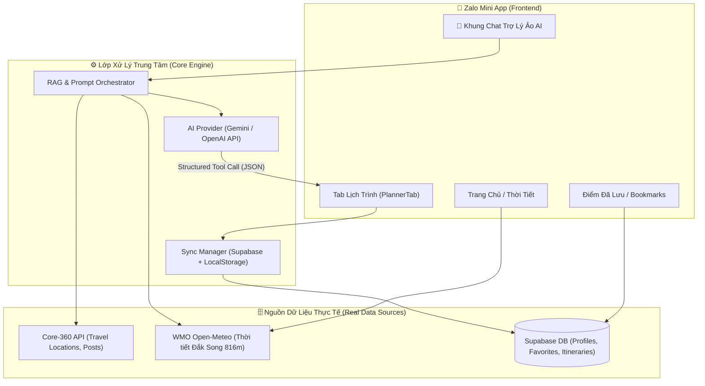

# 🗺️ ĐỀ ÁN KẾ HOẠCH PHÁT TRIỂN MODULE LỊCH TRÌNH & TRỢ LÝ ẢO DU LỊCH AI (ĐẮK SONG)

> **Dự án**: Zalo Mini App - Cổng Văn Hóa Du Lịch Đắk Song  
> **Chủ quản**: UBND Huyện Đắk Song & Đối tác Công nghệ VNA Group  
> **Phiên bản tài liệu**: 1.0 (Cập nhật tháng 10/2026)  

---

## 📌 1. TỔNG QUAN & TẦM NHÌN DỰ ÁN

Mục tiêu của module Lịch trình (Itinerary System) là chuyển đổi từ một trang gợi ý tour tĩnh thành **Hệ sinh thái đồng hành du lịch thông minh**, đóng vai trò là "Người hướng dẫn viên số địa phương" cho mọi du khách khi đến Đắk Song:
1. **Trước chuyến đi**: Tư vấn lịch trình cá nhân hóa dựa trên thời gian, sở thích và điều kiện thời tiết thực tế.
2. **Trong chuyến đi**: Chỉ đường từng chặng, cung cấp thông tin liên hệ, hotline ẩm thực/lưu trú, hỗ trợ xem trước 3D VR 360°.
3. **Trợ lý Ảo Chat AI**: Ứng dụng mô hình ngôn ngữ lớn (LLMs - Gemini / OpenAI) để giải đáp thắc mắc và tự động tạo lịch trình trực tiếp qua cuộc trò chuyện tự nhiên.

---

## 🏗️ 2. KIẾN TRÚC HỆ THỐNG TỔNG THỂ (SYSTEM ARCHITECTURE)



---

## 🧩 3. CHUẨN HÓA DỮ LIỆU ĐẦU RA CHO AI (AI STRUCTURED SCHEMA)

Để Chat AI có thể sinh ra lịch trình chuẩn xác mà không bịa đặt (hallucination), chúng ta sử dụng **Function Calling / Structured Outputs** theo cấu trúc đã được định nghĩa tại `src/services/supabase/types.ts`:

```typescript
export interface ItineraryStop {
  time: string;           // '07:30 - 09:00'
  title: string;          // 'Đón bình minh & Check-in Cánh đồng Điện Gió'
  location: string;       // 'Xã Thuận Hạnh, Đắk Song'
  destId?: string;        // ID liên kết với địa điểm thực tế
  vrNodeId?: string;      // ID node thực tế ảo 3D VR (nếu có)
  desc: string;           // Diễn giải trải nghiệm
  tip?: string;           // Mẹo địa phương (trang phục, thời tiết)
  phone?: string;         // Số điện thoại liên hệ đặt chỗ
  lat?: number;           // Vĩ độ
  lng?: number;           // Kinh độ
}

export interface UserItinerary {
  id: string;             // 'plan_ai_1728374920'
  user_id: string;        // ID người dùng Zalo
  title: string;          // 'Tour Đắk Song Săn Mây 2N1Đ Cùng Gia Đình'
  start_date?: string;    // '2026-10-15'
  days: ItineraryStop[] | { day_number: number; stops: ItineraryStop[] }[];
  created_at: string;
  updated_at: string;
}
```

---

## 🗺️ 4. LỘ TRÌNH 4 GIAI ĐOẠN TRIỂN KHAI

| Giai đoạn | Mục tiêu chính | Trạng thái | Nội dung chi tiết |
| :--- | :--- | :---: | :--- |
| **Giai đoạn 1** | Quản lý & Đồng bộ Lịch trình Cloud | ✅ **Hoàn thành** | • Chuẩn hóa Schema `ItineraryStop`.<br>• Tách 2 tab `[Gợi Ý Tour]` & `[Lịch Trình Của Tôi]`.<br>• Đồng bộ 2 chiều Supabase & LocalStorage.<br>• Xem chi tiết, đổi tên, xóa lịch trình. |
| **Giai đoạn 2** | Ghép Tour Động & Tích hợp Thời Tiết | ⏳ **Kế tiếp** | • Nút "Thêm vào chuyến đi" từ trang chi tiết địa điểm.<br>• Cho phép tự động tạo tour từ các điểm đã thả tim ❤️.<br>• Gắn cảnh báo thời tiết thật (mưa/gió) vào ngày đi. |
| **Giai đoạn 3** | Tích Hợp Trợ Lý Ảo Chat AI | 🚀 **Trọng tâm** | • Nút tròn nổi (Floating Chat AI) khắp ứng dụng.<br>• Chatbot RAG nạp tri thức văn hóa, ẩm thực Đắk Song.<br>• Nút "AI Lên Lịch Trình Ngay" tự động trả về Card lịch trình tương tác. |
| **Giai đoạn 4** | Chia Sẻ Zalo & Khám Phá Cộng Đồng | 🔮 **Mở rộng** | • Chia sẻ lịch trình qua tin nhắn Zalo kèm ảnh preview.<br>• Tab các lịch trình mẫu của UBND Huyện theo mùa lễ hội. |

---

## 🤖 5. THIẾT KẾ CHI TIẾT GIAI ĐOẠN 3: TÍCH HỢP CHAT AI

### 5.1. Cơ chế RAG (Retrieval-Augmented Generation) cho Đắk Song
Để AI trả lời am hiểu như người bản địa, câu hỏi của người dùng sẽ được bọc kèm ngữ cảnh:
```text
System Prompt:
"Bạn là Trợ lý Du lịch Ảo thông minh của Cổng Thông Tin Du Lịch Huyện Đắk Song, Đắk Nông.
- Tọa độ huyện: Độ cao ~800m, thời tiết mát mẻ quanh năm, nổi tiếng với đồi quạt gió điện gió, hồ tiêu hữu cơ số 1 Việt Nam, Thiền viện Trúc Lâm Đạo Nguyên, Thác Lưu Ly...
- Thời tiết hiện tại: {liveWeatherData.temperature}°C, Sức gió: {liveWeatherData.windSpeed} km/h ({liveWeatherData.conditionVi}).
- Danh sách địa điểm thật sẵn có: {travelLocationsList}.

Khi người dùng yêu cầu lên lịch trình, hãy luôn trả lời lịch sự, thân thiện và gọi tool 'create_itinerary' với danh sách các chặng dừng có thật trong hệ thống."
```

### 5.2. Luồng trải nghiệm người dùng với Chat AI:
1. Du khách mở khung chat: *"Cuối tuần này mình và bạn gái muốn đi Đắk Song 1 ngày chụp ảnh sống ảo và ngắm hoàng hôn, gợi ý giúp mình với!"*
2. AI phân tích:
   - Thời gian: 1 ngày.
   - Mục đích: Check-in, chụp ảnh đẹp, ngắm hoàng hôn.
   - Thời tiết: Hôm nay trời gió mát 16km/h, tạnh ráo.
3. AI phản hồi:
   - Tin nhắn tư vấn: *"Chào bạn! Cuối tuần này thời tiết Đắk Song rất đẹp (24°C, gió mát 16km/h), cực kỳ lý tưởng để check-in quạt gió và săn hoàng hôn. Mình đã thiết kế riêng cho 2 bạn lịch trình 1 ngày dưới đây:"*
   - Kèm một **Thẻ Lịch trình Tương tác (Interactive Card)** với 4 chặng:
     1. 07:00: Săn mây đồi thông QL14
     2. 09:00: Check-in trụ điện gió Thuận Hạnh
     3. 12:00: Cơm lam gà nướng Đức An
     4. 16:30: Ngắm hoàng hôn đỏ rực tại Đồi gió Nam Bình
   - Bên dưới thẻ có nút: **[❤️ Lưu vào Lịch Trình Của Tôi]** -> Bấm 1 chạm lưu thẳng vào Supabase!

---

## 🎯 6. BƯỚC ĐI TIẾP THEO ĐỀ XUẤT

Để tiến hành từng bước vững chắc:
- **Bước tiếp theo (Giai đoạn 2)**: Bổ sung tính năng **"Tạo lịch trình từ mục đã lưu"** (chọn các điểm đã thích để gom thành tour) và nút **"Thêm vào lịch trình"** trên các thẻ địa điểm.
- Sau khi hoàn thành Giai đoạn 2, chúng ta sẽ bắt tay tích hợp ngay **Giao diện Chat AI và API LLM** (Giai đoạn 3).

